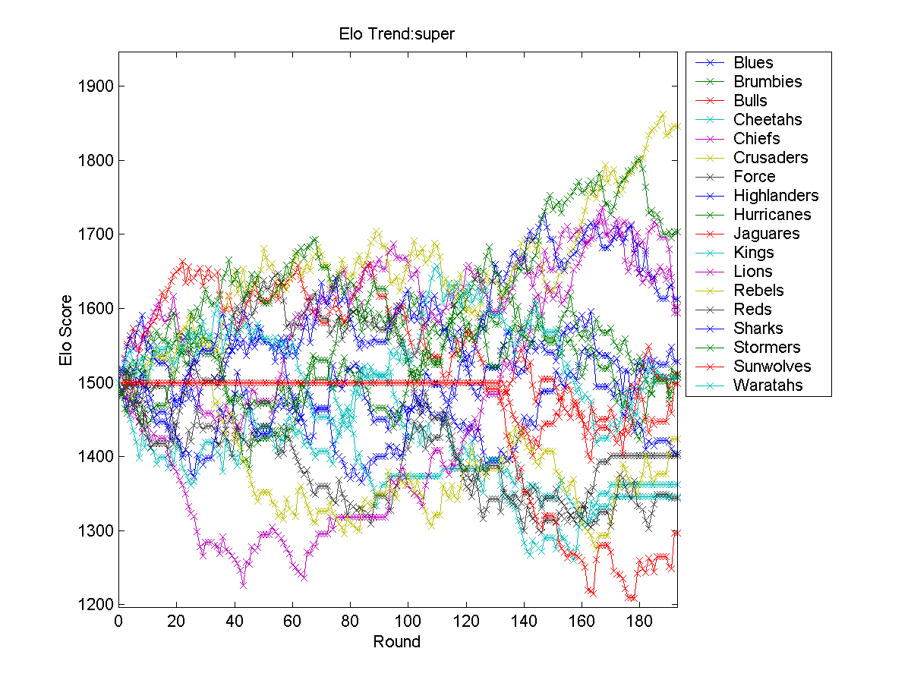

# AustralianElo
Australian ELO Sports Prediction Model

# Contents

[Raw Data](#rawdata)

[Graphs](#graphs)

[Training](#training)

[Predictions](#predictions)

<a name="rawdata"/>

# Raw Data

## Australian Football League (AFL)

[AFL 2009-2018](https://github.com/robmakepeace/AustralianElo/blob/master/RawData/AFL/afl.csv)

[AFL 2009](https://github.com/robmakepeace/AustralianElo/blob/master/RawData/AFL/afl_2009.csv)

[AFL 2010](https://github.com/robmakepeace/AustralianElo/blob/master/RawData/AFL/afl_2010.csv)

[AFL 2011](https://github.com/robmakepeace/AustralianElo/blob/master/RawData/AFL/afl_2011.csv)

[AFL 2012](https://github.com/robmakepeace/AustralianElo/blob/master/RawData/AFL/afl_2012.csv)

[AFL 2013](https://github.com/robmakepeace/AustralianElo/blob/master/RawData/AFL/afl_2013.csv)

[AFL 2014](https://github.com/robmakepeace/AustralianElo/blob/master/RawData/AFL/afl_2014.csv)

[AFL 2015](https://github.com/robmakepeace/AustralianElo/blob/master/RawData/AFL/afl_2015.csv)

[AFL 2016](https://github.com/robmakepeace/AustralianElo/blob/master/RawData/AFL/afl_2016.csv)

[AFL 2017](https://github.com/robmakepeace/AustralianElo/blob/master/RawData/AFL/afl_2017.csv)

[AFL 2018](https://github.com/robmakepeace/AustralianElo/blob/master/RawData/AFL/afl_2018.csv)

[Data Format/Team Indexes](./RawData/AFL/)

## National Rugby League (NRL)
[NRL 2009-2018](https://github.com/robmakepeace/AustralianElo/blob/master/RawData/NRL/nrl.csv)

[NRL 2009](https://github.com/robmakepeace/AustralianElo/blob/master/RawData/NRL/nrl_2009.csv)

[NRL 2010](https://github.com/robmakepeace/AustralianElo/blob/master/RawData/NRL/nrl_2010.csv)

[NRL 2011](https://github.com/robmakepeace/AustralianElo/blob/master/RawData/NRL/nrl_2011.csv)

[NRL 2012](https://github.com/robmakepeace/AustralianElo/blob/master/RawData/NRL/nrl_2012.csv)

[NRL 2013](https://github.com/robmakepeace/AustralianElo/blob/master/RawData/NRL/nrl_2013.csv)

[NRL 2014](https://github.com/robmakepeace/AustralianElo/blob/master/RawData/NRL/nrl_2014.csv)

[NRL 2015](https://github.com/robmakepeace/AustralianElo/blob/master/RawData/NRL/nrl_2015.csv)

[NRL 2016](https://github.com/robmakepeace/AustralianElo/blob/master/RawData/NRL/nrl_2016.csv)

[NRL 2017](https://github.com/robmakepeace/AustralianElo/blob/master/RawData/NRL/nrl_2017.csv)

[NRL 2018](https://github.com/robmakepeace/AustralianElo/blob/master/RawData/NRL/nrl_2018.csv)

[Data Format/Team Indexes](./RawData/NRL/)

## A-League 
[A-League 2008-2018](https://github.com/robmakepeace/AustralianElo/blob/master/RawData/ALeague/aleague.csv)

[A-League 2008-2009](https://github.com/robmakepeace/AustralianElo/blob/master/RawData/ALeague/aleague_2008_2009.csv)

[A-League 2009-2010](https://github.com/robmakepeace/AustralianElo/blob/master/RawData/ALeague/aleague_2009_2010.csv)

[A-League 2010-2011](https://github.com/robmakepeace/AustralianElo/blob/master/RawData/ALeague/aleague_2010_2011.csv)

[A-League 2011-2012](https://github.com/robmakepeace/AustralianElo/blob/master/RawData/ALeague/aleague_2011_2012.csv)

[A-League 2012-2013](https://github.com/robmakepeace/AustralianElo/blob/master/RawData/ALeague/aleague_2012_2013.csv)

[A-League 2013-2014](https://github.com/robmakepeace/AustralianElo/blob/master/RawData/ALeague/aleague_2013_2014.csv)

[A-League 2014-2015](https://github.com/robmakepeace/AustralianElo/blob/master/RawData/ALeague/aleague_2014_2015.csv)

[A-League 2015-2016](https://github.com/robmakepeace/AustralianElo/blob/master/RawData/ALeague/aleague_2015_2016.csv)

[A-League 2016-2017](https://github.com/robmakepeace/AustralianElo/blob/master/RawData/ALeague/aleague_2016_2017.csv)

[A-League 2017-2018](https://github.com/robmakepeace/AustralianElo/blob/master/RawData/ALeague/aleague_2017_2018.csv)

[Data Format/Team Indexes](./RawData/ALeague/)

## Super Rugby
[Super Rugby 2009-2018](https://github.com/robmakepeace/AustralianElo/blob/master/RawData/SuperRugby/super.csv)

[Super Rugby 2009](https://github.com/robmakepeace/AustralianElo/blob/master/RawData/SuperRugby/super_2009.csv)

[Super Rugby 2010](https://github.com/robmakepeace/AustralianElo/blob/master/RawData/SuperRugby/super_2010.csv)

[Super Rugby 2011](https://github.com/robmakepeace/AustralianElo/blob/master/RawData/SuperRugby/super_2011.csv)

[Super Rugby 2012](https://github.com/robmakepeace/AustralianElo/blob/master/RawData/SuperRugby/super_2012.csv)

[Super Rugby 2013](https://github.com/robmakepeace/AustralianElo/blob/master/RawData/SuperRugby/super_2013.csv)

[Super Rugby 2014](https://github.com/robmakepeace/AustralianElo/blob/master/RawData/SuperRugby/super_2014.csv)

[Super Rugby 2015](https://github.com/robmakepeace/AustralianElo/blob/master/RawData/SuperRugby/super_2015.csv)

[Super Rugby 2016](https://github.com/robmakepeace/AustralianElo/blob/master/RawData/SuperRugby/super_2016.csv)

[Super Rugby 2017](https://github.com/robmakepeace/AustralianElo/blob/master/RawData/SuperRugby/super_2017.csv)

[Super Rugby 2018](https://github.com/robmakepeace/AustralianElo/blob/master/RawData/SuperRugby/super_2018.csv)

[Data Format/Team Indexes](./RawData/SuperRugby/)

## Big Bash
[Big Bash 2011-2018](https://github.com/robmakepeace/AustralianElo/blob/master/RawData/BigBash/bigbash.csv)

[Big Bash 2011-2012](https://github.com/robmakepeace/AustralianElo/blob/master/RawData/BigBash/bigbash_2011_2012.csv)

[Big Bash 2012-2013](https://github.com/robmakepeace/AustralianElo/blob/master/RawData/BigBash/bigbash_2012_2013.csv)

[Big Bash 2013-2014](https://github.com/robmakepeace/AustralianElo/blob/master/RawData/BigBash/bigbash_2013_2014.csv)

[Big Bash 2014-2015](https://github.com/robmakepeace/AustralianElo/blob/master/RawData/BigBash/bigbash_2014_2015.csv)

[Big Bash 2015-2016](https://github.com/robmakepeace/AustralianElo/blob/master/RawData/BigBash/bigbash_2015_2016.csv)

[Big Bash 2016-2017](https://github.com/robmakepeace/AustralianElo/blob/master/RawData/BigBash/bigbash_2016_2017.csv)

[Big Bash 2017-2018](https://github.com/robmakepeace/AustralianElo/blob/master/RawData/BigBash/bigbash_2017_2018.csv)

[Data Format/Team Indexes](./RawData/Big Bash/)

<a name="graphs"/>

# Graphs

## AFL

## NRL

## A-League

## Super Rugby

<a name="training"/>

# Training

## AFL

[AFL](https://github.com/robmakepeace/AustralianElo/blob/master/Training/AFL/afl_training.txt)

## NRL

[NRL](https://github.com/robmakepeace/AustralianElo/blob/master/Training/NRL/nrl_training.txt)

## A-League

[A-League](https://github.com/robmakepeace/AustralianElo/blob/master/Training/Aleague/aleague_training.txt)

## Super Rugby

[Super Rugby](https://github.com/robmakepeace/AustralianElo/blob/master/Training/SuperRugby/super_training.txt)

<a name="predictions"/>

# Predictions
