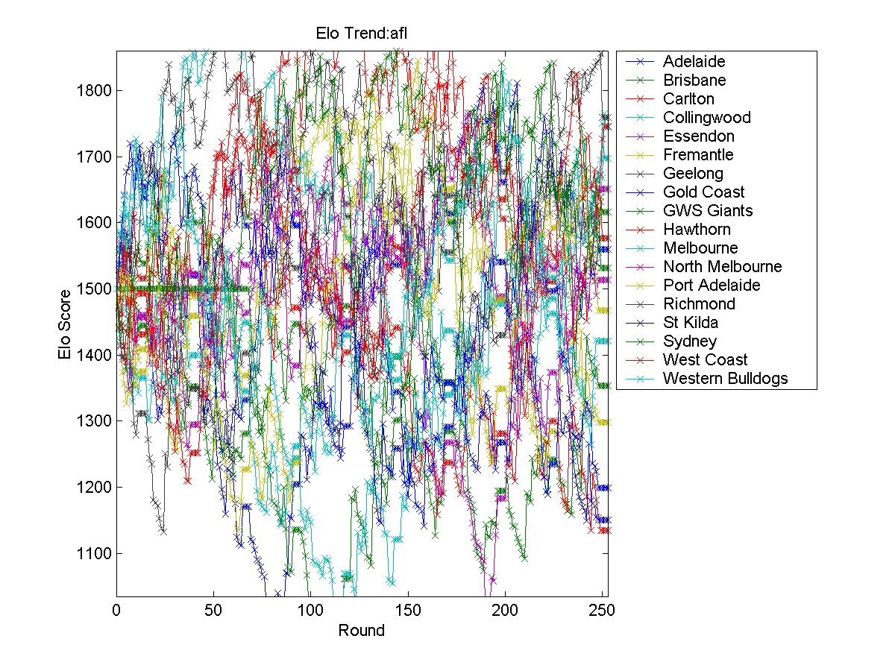
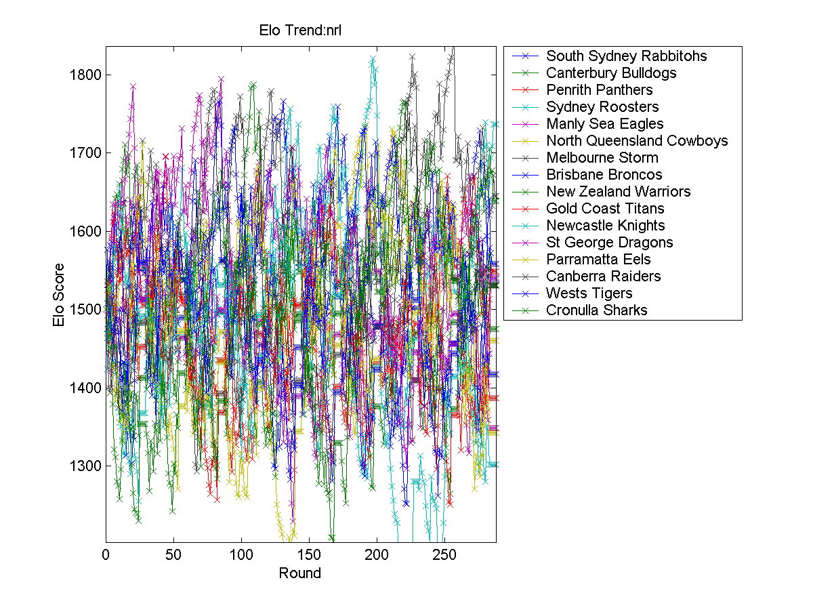
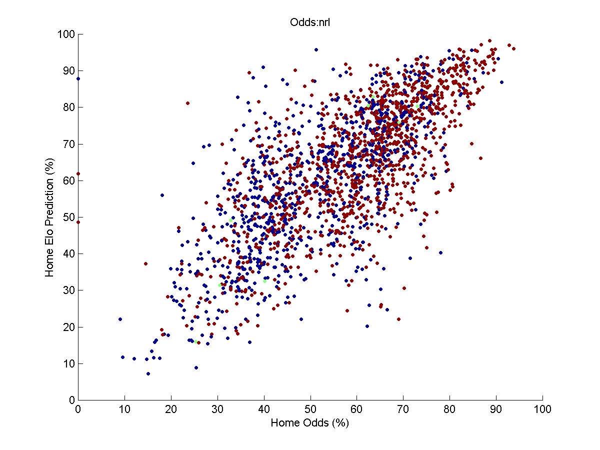
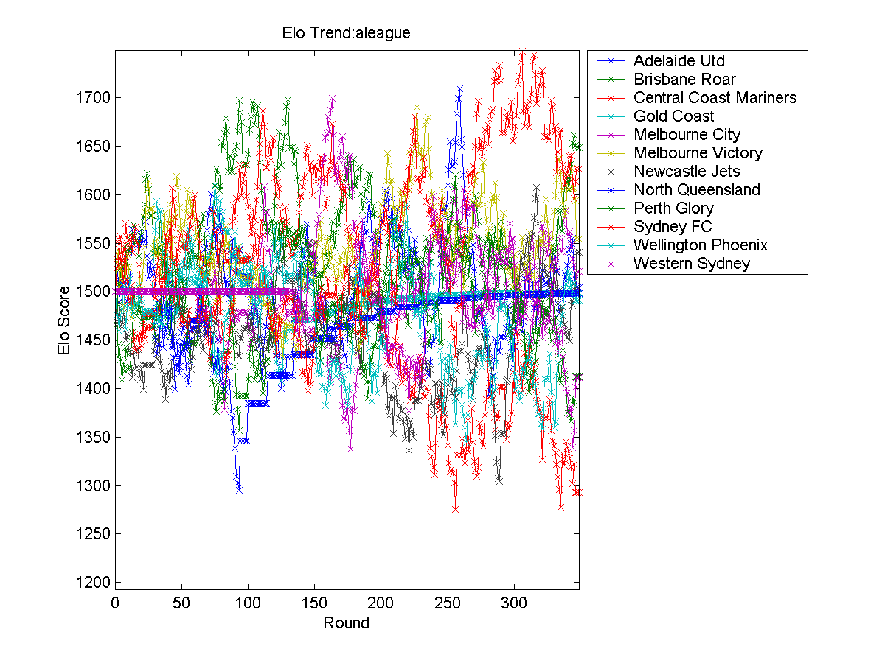
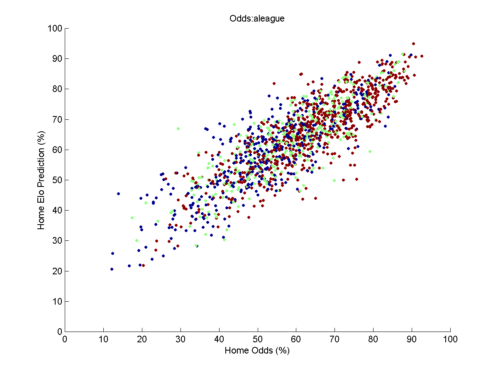
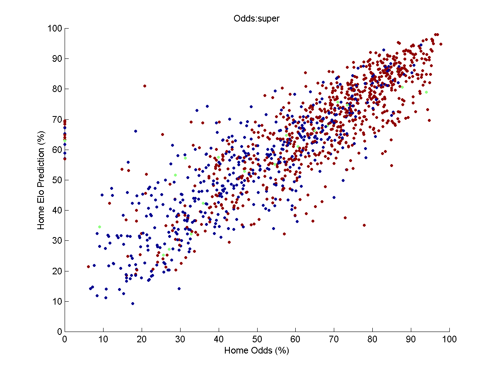

# AustralianElo
Australian ELO Sports Prediction Model

# Contents

[Raw Data](#rawdata)

[Graphs](#graphs)

[Training](#training)

[Predictions](#predictions)

<a name="rawdata"/>

# Raw Data

## Australian Football League (AFL)

[AFL 2009-2018](https://github.com/robmakepeace/AustralianElo/blob/master/RawData/AFL/afl.csv)

[AFL 2009](https://github.com/robmakepeace/AustralianElo/blob/master/RawData/AFL/afl_2009.csv)

[AFL 2010](https://github.com/robmakepeace/AustralianElo/blob/master/RawData/AFL/afl_2010.csv)

[AFL 2011](https://github.com/robmakepeace/AustralianElo/blob/master/RawData/AFL/afl_2011.csv)

[AFL 2012](https://github.com/robmakepeace/AustralianElo/blob/master/RawData/AFL/afl_2012.csv)

[AFL 2013](https://github.com/robmakepeace/AustralianElo/blob/master/RawData/AFL/afl_2013.csv)

[AFL 2014](https://github.com/robmakepeace/AustralianElo/blob/master/RawData/AFL/afl_2014.csv)

[AFL 2015](https://github.com/robmakepeace/AustralianElo/blob/master/RawData/AFL/afl_2015.csv)

[AFL 2016](https://github.com/robmakepeace/AustralianElo/blob/master/RawData/AFL/afl_2016.csv)

[AFL 2017](https://github.com/robmakepeace/AustralianElo/blob/master/RawData/AFL/afl_2017.csv)

[AFL 2018](https://github.com/robmakepeace/AustralianElo/blob/master/RawData/AFL/afl_2018.csv)

[Data Format/Team Indexes](./RawData/AFL/)

## National Rugby League (NRL)
[NRL 2009-2018](https://github.com/robmakepeace/AustralianElo/blob/master/RawData/NRL/nrl.csv)

[NRL 2009](https://github.com/robmakepeace/AustralianElo/blob/master/RawData/NRL/nrl_2009.csv)

[NRL 2010](https://github.com/robmakepeace/AustralianElo/blob/master/RawData/NRL/nrl_2010.csv)

[NRL 2011](https://github.com/robmakepeace/AustralianElo/blob/master/RawData/NRL/nrl_2011.csv)

[NRL 2012](https://github.com/robmakepeace/AustralianElo/blob/master/RawData/NRL/nrl_2012.csv)

[NRL 2013](https://github.com/robmakepeace/AustralianElo/blob/master/RawData/NRL/nrl_2013.csv)

[NRL 2014](https://github.com/robmakepeace/AustralianElo/blob/master/RawData/NRL/nrl_2014.csv)

[NRL 2015](https://github.com/robmakepeace/AustralianElo/blob/master/RawData/NRL/nrl_2015.csv)

[NRL 2016](https://github.com/robmakepeace/AustralianElo/blob/master/RawData/NRL/nrl_2016.csv)

[NRL 2017](https://github.com/robmakepeace/AustralianElo/blob/master/RawData/NRL/nrl_2017.csv)

[NRL 2018](https://github.com/robmakepeace/AustralianElo/blob/master/RawData/NRL/nrl_2018.csv)

[Data Format/Team Indexes](./RawData/NRL/)

## A-League 
[A-League 2008-2018](https://github.com/robmakepeace/AustralianElo/blob/master/RawData/ALeague/aleague.csv)

[A-League 2008-2009](https://github.com/robmakepeace/AustralianElo/blob/master/RawData/ALeague/aleague_2008_2009.csv)

[A-League 2009-2010](https://github.com/robmakepeace/AustralianElo/blob/master/RawData/ALeague/aleague_2009_2010.csv)

[A-League 2010-2011](https://github.com/robmakepeace/AustralianElo/blob/master/RawData/ALeague/aleague_2010_2011.csv)

[A-League 2011-2012](https://github.com/robmakepeace/AustralianElo/blob/master/RawData/ALeague/aleague_2011_2012.csv)

[A-League 2012-2013](https://github.com/robmakepeace/AustralianElo/blob/master/RawData/ALeague/aleague_2012_2013.csv)

[A-League 2013-2014](https://github.com/robmakepeace/AustralianElo/blob/master/RawData/ALeague/aleague_2013_2014.csv)

[A-League 2014-2015](https://github.com/robmakepeace/AustralianElo/blob/master/RawData/ALeague/aleague_2014_2015.csv)

[A-League 2015-2016](https://github.com/robmakepeace/AustralianElo/blob/master/RawData/ALeague/aleague_2015_2016.csv)

[A-League 2016-2017](https://github.com/robmakepeace/AustralianElo/blob/master/RawData/ALeague/aleague_2016_2017.csv)

[A-League 2017-2018](https://github.com/robmakepeace/AustralianElo/blob/master/RawData/ALeague/aleague_2017_2018.csv)

[Data Format/Team Indexes](./RawData/ALeague/)

## Super Rugby
[Super Rugby 2009-2018](https://github.com/robmakepeace/AustralianElo/blob/master/RawData/SuperRugby/super.csv)

[Super Rugby 2009](https://github.com/robmakepeace/AustralianElo/blob/master/RawData/SuperRugby/super_2009.csv)

[Super Rugby 2010](https://github.com/robmakepeace/AustralianElo/blob/master/RawData/SuperRugby/super_2010.csv)

[Super Rugby 2011](https://github.com/robmakepeace/AustralianElo/blob/master/RawData/SuperRugby/super_2011.csv)

[Super Rugby 2012](https://github.com/robmakepeace/AustralianElo/blob/master/RawData/SuperRugby/super_2012.csv)

[Super Rugby 2013](https://github.com/robmakepeace/AustralianElo/blob/master/RawData/SuperRugby/super_2013.csv)

[Super Rugby 2014](https://github.com/robmakepeace/AustralianElo/blob/master/RawData/SuperRugby/super_2014.csv)

[Super Rugby 2015](https://github.com/robmakepeace/AustralianElo/blob/master/RawData/SuperRugby/super_2015.csv)

[Super Rugby 2016](https://github.com/robmakepeace/AustralianElo/blob/master/RawData/SuperRugby/super_2016.csv)

[Super Rugby 2017](https://github.com/robmakepeace/AustralianElo/blob/master/RawData/SuperRugby/super_2017.csv)

[Super Rugby 2018](https://github.com/robmakepeace/AustralianElo/blob/master/RawData/SuperRugby/super_2018.csv)

[Data Format/Team Indexes](./RawData/SuperRugby/)

## Big Bash
[Big Bash 2011-2018](https://github.com/robmakepeace/AustralianElo/blob/master/RawData/BigBash/bigbash.csv)

[Big Bash 2011-2012](https://github.com/robmakepeace/AustralianElo/blob/master/RawData/BigBash/bigbash_2011_2012.csv)

[Big Bash 2012-2013](https://github.com/robmakepeace/AustralianElo/blob/master/RawData/BigBash/bigbash_2012_2013.csv)

[Big Bash 2013-2014](https://github.com/robmakepeace/AustralianElo/blob/master/RawData/BigBash/bigbash_2013_2014.csv)

[Big Bash 2014-2015](https://github.com/robmakepeace/AustralianElo/blob/master/RawData/BigBash/bigbash_2014_2015.csv)

[Big Bash 2015-2016](https://github.com/robmakepeace/AustralianElo/blob/master/RawData/BigBash/bigbash_2015_2016.csv)

[Big Bash 2016-2017](https://github.com/robmakepeace/AustralianElo/blob/master/RawData/BigBash/bigbash_2016_2017.csv)

[Big Bash 2017-2018](https://github.com/robmakepeace/AustralianElo/blob/master/RawData/BigBash/bigbash_2017_2018.csv)

[Data Format/Team Indexes](./RawData/Big Bash/)

<a name="graphs"/>

# Graphs

## AFL

## NRL

## A-League

## Super Rugby

<a name="training"/>

# Training

## AFL

[AFL](https://github.com/robmakepeace/AustralianElo/blob/master/Training/AFL/afl_training.txt)

## NRL

[NRL](https://github.com/robmakepeace/AustralianElo/blob/master/Training/NRL/nrl_training.txt)

## A-League

[A-League](https://github.com/robmakepeace/AustralianElo/blob/master/Training/Aleague/aleague_training.txt)

## Super Rugby

[Super Rugby](https://github.com/robmakepeace/AustralianElo/blob/master/Training/SuperRugby/super_training.txt)

<a name="predictions"/>

# Predictions

## AFL

### Current Predictions

[AFL CSV](https://github.com/robmakepeace/AustralianElo/blob/master/Predictions/AFL/afl_future_predictions.csv)

### Round 1 (generated 13/03/2018)

Robs Elo predicts 	Richmond             (home) to beat 	Carlton              (away) with a probability of 	96.69%

Robs Elo predicts 	Adelaide             (away) to beat 	Essendon             (home) with a probability of 	50.07%

Robs Elo predicts 	St Kilda             (home) to beat 	Brisbane             (away) with a probability of 	89.35%

Robs Elo predicts 	Port Adelaide        (home) to beat 	Fremantle            (away) with a probability of 	91.55%

Robs Elo predicts 	North Melbourne      (away) to beat 	Gold Coast           (home) with a probability of 	51.05%

Robs Elo predicts 	Hawthorn             (home) to beat 	Collingwood          (away) with a probability of 	70.31%

Robs Elo predicts 	GWS Giants           (home) to beat 	Western Bulldogs     (away) with a probability of 	83.06%

Robs Elo predicts 	Melbourne            (home) to beat 	Geelong              (away) with a probability of 	51.72%

Robs Elo predicts 	Sydney               (away) to beat 	West Coast           (home) with a probability of 	56.47%

### Round 2 (generated 26/03/2018)

Robs Elo predicts 	Richmond             (away) to beat 	Adelaide             (home) with a probability of 	56.01%

Robs Elo predicts 	St Kilda             (away) to beat 	North Melbourne      (home) with a probability of 	56.85%

Robs Elo predicts 	Carlton              (home) to beat 	Gold Coast           (away) with a probability of 	68.35%

Robs Elo predicts 	GWS Giants           (away) to beat 	Collingwood          (home) with a probability of 	60.06%

Robs Elo predicts 	Melbourne            (away) to beat 	Brisbane             (home) with a probability of 	69.33%

Robs Elo predicts 	Essendon             (away) to beat 	Fremantle            (home) with a probability of 	70.33%

Robs Elo predicts 	West Coast           (away) to beat 	Western Bulldogs     (home) with a probability of 	55.39%

Robs Elo predicts 	Sydney               (home) to beat 	Port Adelaide        (away) with a probability of 	72.80%

Robs Elo predicts 	Geelong              (home) to beat 	Hawthorn             (away) with a probability of 	78.79%

### Round 3 (generated 05/04/2018)

Robs Elo predicts 	Collingwood          (away) to beat 	Carlton              (home) with a probability of 	59.76%

Robs Elo predicts 	Port Adelaide        (home) to beat 	Brisbane             (away) with a probability of 	96.10%

Robs Elo predicts 	Melbourne            (home) to beat 	North Melbourne      (away) with a probability of 	80.47%

Robs Elo predicts 	Gold Coast           (home) to beat 	Fremantle            (away) with a probability of 	67.20%

Robs Elo predicts 	Sydney               (home) to beat 	GWS Giants           (away) with a probability of 	55.15%

Robs Elo predicts 	Adelaide             (away) to beat 	St Kilda             (home) with a probability of 	63.94%

Robs Elo predicts 	Richmond             (home) to beat 	Hawthorn             (away) with a probability of 	83.85%

Robs Elo predicts 	Western Bulldogs     (home) to beat 	Essendon             (away) with a probability of 	54.74%

Robs Elo predicts 	West Coast           (home) to beat 	Geelong              (away) with a probability of 	69.49%

### Round 4 (generated 11/04/2018)

Robs Elo predicts 	Adelaide             (home) to beat 	Collingwood          (away) with a probability of 	88.69%

Robs Elo predicts 	GWS Giants           (home) to beat 	Fremantle            (away) with a probability of 	88.70%

Robs Elo predicts 	Richmond             (home) to beat 	Brisbane             (away) with a probability of 	97.41%

Robs Elo predicts 	Sydney               (away) to beat 	Western Bulldogs     (home) with a probability of 	57.26%

Robs Elo predicts 	North Melbourne      (home) to beat 	Carlton              (away) with a probability of 	84.30%

Robs Elo predicts 	West Coast           (home) to beat 	Gold Coast           (away) with a probability of 	94.74%

Robs Elo predicts 	Port Adelaide        (away) to beat 	Essendon             (home) with a probability of 	60.28%

Robs Elo predicts 	Hawthorn             (home) to beat 	Melbourne            (away) with a probability of 	66.52%

Robs Elo predicts 	Geelong              (home) to beat 	St Kilda             (away) with a probability of 	86.09%

### Round 5 (generated 19/04/2018)

Robs Elo predicts 	Sydney               (home) to beat 	Adelaide             (away) with a probability of 	71.72%

Robs Elo predicts 	GWS Giants           (away) to beat 	St Kilda             (home) with a probability of 	67.52%

Robs Elo predicts 	West Coast           (away) to beat 	Carlton              (home) with a probability of 	89.11%

Robs Elo predicts 	Port Adelaide        (home) to beat 	Geelong              (away) with a probability of 	64.40%

Robs Elo predicts 	Fremantle            (home) to beat 	Western Bulldogs     (away) with a probability of 	61.67%

Robs Elo predicts 	Hawthorn             (away) to beat 	North Melbourne      (home) with a probability of 	58.26%

Robs Elo predicts 	Brisbane             (home) to beat 	Gold Coast           (away) with a probability of 	56.77%

Robs Elo predicts 	Richmond             (away) to beat 	Melbourne            (home) with a probability of 	64.39%

Robs Elo predicts 	Collingwood          (home) to beat 	Essendon             (away) with a probability of 	71.48%

### Round 6 (generated 24/04/2018)

Robs Elo predicts 	Western Bulldogs     (home) to beat 	Carlton              (away) with a probability of 	86.42%

Robs Elo predicts 	Geelong              (home) to beat 	Sydney               (away) with a probability of 	76.09%

Robs Elo predicts 	North Melbourne      (home) to beat 	Port Adelaide        (away) with a probability of 	53.45%

Robs Elo predicts 	GWS Giants           (home) to beat 	Brisbane             (away) with a probability of 	96.45%

Robs Elo predicts 	Hawthorn             (home) to beat 	St Kilda             (away) with a probability of 	79.77%

Robs Elo predicts 	Adelaide             (home) to beat 	Gold Coast           (away) with a probability of 	93.09%

Robs Elo predicts 	Essendon             (home) to beat 	Melbourne            (away) with a probability of 	68.26%

Robs Elo predicts 	Richmond             (away) to beat 	Collingwood          (home) with a probability of 	58.24%

Robs Elo predicts 	West Coast           (away) to beat 	Fremantle            (home) with a probability of 	68.33%

### Round 7 (generated 02/05/2018)

Robs Elo predicts 	GWS Giants           (away) to beat 	Carlton              (home) with a probability of 	88.04%

Robs Elo predicts 	Western Bulldogs     (home) to beat 	Gold Coast           (away) with a probability of 	77.41%

Robs Elo predicts 	Essendon             (home) to beat 	Hawthorn             (away) with a probability of 	50.88%

Robs Elo predicts 	West Coast           (home) to beat 	Port Adelaide        (away) with a probability of 	78.70%

Robs Elo predicts 	Sydney               (home) to beat 	North Melbourne      (away) with a probability of 	89.26%

Robs Elo predicts 	Adelaide             (home) to beat 	Carlton              (away) with a probability of 	96.76%

Robs Elo predicts 	Richmond             (home) to beat 	Fremantle            (away) with a probability of 	94.73%

Robs Elo predicts 	Melbourne            (away) to beat 	St Kilda             (home) with a probability of 	54.28%

Robs Elo predicts 	Collingwood          (away) to beat 	Brisbane             (home) with a probability of 	79.84%

### Round 8 (generated 09/05/2018)

Robs Elo predicts 	Hawthorn             (home) to beat 	Sydney               (away) with a probability of 	60.19%

Robs Elo predicts 	West Coast           (away) to beat 	GWS Giants           (home) with a probability of 	59.76%

Robs Elo predicts 	Carlton              (home) to beat 	Essendon             (away) with a probability of 	53.03%

Robs Elo predicts 	Melbourne            (away) to beat 	Gold Coast           (home) with a probability of 	71.94%

Robs Elo predicts 	Port Adelaide        (home) to beat 	Adelaide             (away) with a probability of 	55.64%

Robs Elo predicts 	Western Bulldogs     (home) to beat 	Brisbane             (away) with a probability of 	88.48%

Robs Elo predicts 	Fremantle            (home) to beat 	St Kilda             (away) with a probability of 	74.07%

Robs Elo predicts 	Richmond             (away) to beat 	North Melbourne      (home) with a probability of 	80.62%

Robs Elo predicts 	Collingwood          (home) to beat 	Geelong              (away) with a probability of 	57.68%

### Round 9 (generated 19/05/2018)

Robs Elo predicts 	Adelaide             (home) to beat 	Western Bulldogs     (away) with a probability of 	87.29%

Robs Elo predicts 	North Melbourne      (home) to beat 	GWS Giants           (away) with a probability of 	56.32%

Robs Elo predicts 	Port Adelaide        (away) to beat 	Gold Coast           (home) with a probability of 	76.77%

Robs Elo predicts 	Geelong              (away) to beat 	Essendon             (home) with a probability of 	74.82%

Robs Elo predicts 	Sydney               (home) to beat 	Fremantle            (away) with a probability of 	88.06%

Robs Elo predicts 	Collingwood          (away) to beat 	St Kilda             (home) with a probability of 	59.32%

Robs Elo predicts 	Melbourne            (away) to beat 	Carlton              (home) with a probability of 	71.73%

Robs Elo predicts 	Hawthorn             (away) to beat 	Brisbane             (home) with a probability of 	81.30%

Robs Elo predicts 	West Coast           (home) to beat 	Richmond             (away) with a probability of 	58.19%

### Round 10 (generated 23/05/2018)

Robs Elo predicts 	Collingwood          (home) to beat 	Western Bulldogs     (away) with a probability of 	81.25%

Robs Elo predicts 	Richmond             (home) to beat 	St Kilda             (away) with a probability of 	96.86%

Robs Elo predicts 	Sydney               (away) to beat 	Brisbane             (home) with a probability of 	83.38%

Robs Elo predicts 	Geelong              (home) to beat 	Carlton              (away) with a probability of 	91.61%

Robs Elo predicts 	GWS Giants           (home) to beat 	Essendon             (away) with a probability of 	69.69%

Robs Elo predicts 	West Coast           (away) to beat 	Hawthorn             (home) with a probability of 	78.38%

Robs Elo predicts 	Melbourne            (home) to beat 	Adelaide             (away) with a probability of 	65.09%

Robs Elo predicts 	Fremantle            (home) to beat 	North Melbourne      (away) with a probability of 	60.46%

### Round 11 (generated 29/05/2018)

Robs Elo predicts 	Sydney               (home) to beat 	Carlton              (away) with a probability of 	95.09%

Robs Elo predicts 	Melbourne            (away) to beat 	Western Bulldogs     (home) with a probability of 	71.46%

Robs Elo predicts 	Port Adelaide        (away) to beat 	Hawthorn             (home) with a probability of 	58.41%

Robs Elo predicts 	Geelong              (away) to beat 	Gold Coast           (home) with a probability of 	78.54%

Robs Elo predicts 	Richmond             (away) to beat 	Essendon             (home) with a probability of 	71.11%

Robs Elo predicts 	West Coast           (home) to beat 	St Kilda             (away) with a probability of 	97.43%

Robs Elo predicts 	North Melbourne      (home) to beat 	Brisbane             (away) with a probability of 	89.77%

Robs Elo predicts 	Collingwood          (home) to beat 	Fremantle            (away) with a probability of 	85.50%

Robs Elo predicts 	Adelaide             (home) to beat 	GWS Giants           (away) with a probability of 	87.02%

### Round 12 (generated 04/06/2018)

Robs Elo predicts 	Richmond             (away) to beat 	Port Adelaide        (home) with a probability of 	65.13%

Robs Elo predicts 	Geelong              (home) to beat 	North Melbourne      (away) with a probability of 	76.80%

Robs Elo predicts 	GWS Giants           (home) to beat 	Gold Coast           (away) with a probability of 	88.53%

Robs Elo predicts 	Sydney               (away) to beat 	St Kilda             (home) with a probability of 	82.80%

Robs Elo predicts 	Essendon             (away) to beat 	Brisbane             (home) with a probability of 	63.74%

Robs Elo predicts 	Adelaide             (away) to beat 	Fremantle            (home) with a probability of 	58.45%

Robs Elo predicts 	Melbourne            (home) to beat 	Collingwood          (away) with a probability of 	80.29%

### Round 13 (generated 13/06/2018)

Robs Elo predicts 	Port Adelaide        (home) to beat 	Western Bulldogs     (away) with a probability of 	89.51%

Robs Elo predicts 	Sydney               (home) to beat 	West Coast           (away) with a probability of 	52.09%

Robs Elo predicts 	Carlton              (home) to beat 	Fremantle            (away) with a probability of 	53.28%

Robs Elo predicts 	Gold Coast           (home) to beat 	St Kilda             (away) with a probability of 	58.50%

Robs Elo predicts 	Hawthorn             (home) to beat 	Adelaide             (away) with a probability of 	61.54%

Robs Elo predicts 	Geelong              (home) to beat 	Richmond             (away) with a probability of 	50.54%

### Round 14 (generated 17/06/2018)

Robs Elo predicts 	West Coast           (home) to beat 	Essendon             (away) with a probability of 	90.72%

Robs Elo predicts 	Port Adelaide        (home) to beat 	Melbourne            (away) with a probability of 	68.26%

Robs Elo predicts 	Hawthorn             (home) to beat 	Gold Coast           (away) with a probability of 	92.49%

Robs Elo predicts 	GWS Giants           (away) to beat 	Brisbane             (home) with a probability of 	67.87%

Robs Elo predicts 	North Melbourne      (away) to beat 	Western Bulldogs     (home) with a probability of 	53.93%

Robs Elo predicts 	Collingwood          (home) to beat 	Carlton              (away) with a probability of 	95.79%

### Round 15 (generated 27/06/2018)

Robs Elo predicts 	Richmond             (home) to beat 	Sydney               (away) with a probability of 	72.83%

Robs Elo predicts 	Geelong              (away) to beat 	Western Bulldogs     (home) with a probability of 	68.18%

Robs Elo predicts 	Port Adelaide        (away) to beat 	Carlton              (home) with a probability of 	85.00%

Robs Elo predicts 	West Coast           (away) to beat 	Adelaide             (home) with a probability of 	62.41%

Robs Elo predicts 	Collingwood          (away) to beat 	Gold Coast           (home) with a probability of 	87.79%

Robs Elo predicts 	GWS Giants           (home) to beat 	Hawthorn             (away) with a probability of 	63.51%

Robs Elo predicts 	Melbourne            (home) to beat 	St Kilda             (away) with a probability of 	92.11%

Robs Elo predicts 	Essendon             (home) to beat 	North Melbourne      (away) with a probability of 	74.25%

Robs Elo predicts 	Fremantle            (home) to beat 	Brisbane             (away) with a probability of 	88.26%

### Round 16 (generated 02/07/2018)

Robs Elo predicts 	Sydney               (home) to beat 	Geelong              (away) with a probability of 	81.26%

Robs Elo predicts 	Richmond             (home) to beat 	Adelaide             (away) with a probability of 	91.44%

Robs Elo predicts 	Brisbane             (home) to beat 	Carlton              (away) with a probability of 	76.17%

Robs Elo predicts 	Port Adelaide        (home) to beat 	St Kilda             (away) with a probability of 	93.32%

Robs Elo predicts 	Hawthorn             (away) to beat 	Western Bulldogs     (home) with a probability of 	51.66%

Robs Elo predicts 	Melbourne            (home) to beat 	Fremantle            (away) with a probability of 	88.64%

Robs Elo predicts 	North Melbourne      (home) to beat 	Gold Coast           (away) with a probability of 	92.48%

Robs Elo predicts 	Essendon             (home) to beat 	Collingwood          (away) with a probability of 	57.81%

Robs Elo predicts 	West Coast           (home) to beat 	GWS Giants           (away) with a probability of 	79.94%

### Round 17 (generated 12/07/2018)

Robs Elo predicts 	Geelong              (away) to beat 	Adelaide             (home) with a probability of 	50.64%

Robs Elo predicts 	St Kilda             (home) to beat 	Carlton              (away) with a probability of 	80.06%

Robs Elo predicts 	Hawthorn             (home) to beat 	Brisbane             (away) with a probability of 	87.80%

Robs Elo predicts 	Melbourne            (home) to beat 	Western Bulldogs     (away) with a probability of 	89.84%

Robs Elo predicts 	Essendon             (away) to beat 	Gold Coast           (home) with a probability of 	81.90%

Robs Elo predicts 	Richmond             (away) to beat 	GWS Giants           (home) with a probability of 	74.41%

Robs Elo predicts 	Collingwood          (home) to beat 	West Coast           (away) with a probability of 	72.83%

Robs Elo predicts 	Sydney               (away) to beat 	North Melbourne      (home) with a probability of 	54.54%

Robs Elo predicts 	Port Adelaide        (away) to beat 	Fremantle            (home) with a probability of 	78.24%

### Round 18 (generated 16/07/2018)

Robs Elo predicts 	Richmond             (away) to beat 	St Kilda             (home) with a probability of 	87.39%

Robs Elo predicts 	Collingwood          (home) to beat 	North Melbourne      (away) with a probability of 	82.81%

Robs Elo predicts 	Sydney               (home) to beat 	Gold Coast           (away) with a probability of 	97.48%

Robs Elo predicts 	Essendon             (home) to beat 	Fremantle            (away) with a probability of 	86.30%

Robs Elo predicts 	Adelaide             (away) to beat 	Brisbane             (home) with a probability of 	52.32%

Robs Elo predicts 	Geelong              (home) to beat 	Melbourne            (away) with a probability of 	67.66%

Robs Elo predicts 	Hawthorn             (away) to beat 	Carlton              (home) with a probability of 	72.28%

Robs Elo predicts 	West Coast           (home) to beat 	Western Bulldogs     (away) with a probability of 	95.45%

Robs Elo predicts 	Port Adelaide        (home) to beat 	GWS Giants           (away) with a probability of 	75.68%

### Round 19 (generated 23/07/2018)

Robs Elo predicts 	Essendon             (home) to beat 	Sydney               (away) with a probability of 	67.86%

Robs Elo predicts 	Richmond             (home) to beat 	Collingwood          (away) with a probability of 	82.30%

Robs Elo predicts 	Geelong              (home) to beat 	Brisbane             (away) with a probability of 	87.32%

Robs Elo predicts 	GWS Giants           (home) to beat 	St Kilda             (away) with a probability of 	90.43%

Robs Elo predicts 	Gold Coast           (home) to beat 	Carlton              (away) with a probability of 	79.70%

Robs Elo predicts 	Adelaide             (home) to beat 	Melbourne            (away) with a probability of 	64.95%

Robs Elo predicts 	West Coast           (away) to beat 	North Melbourne      (home) with a probability of 	68.65%

Robs Elo predicts 	Port Adelaide        (away) to beat 	Western Bulldogs     (home) with a probability of 	66.81%

Robs Elo predicts 	Hawthorn             (away) to beat 	Fremantle            (home) with a probability of 	50.39%

### Round 20 (generated 30/07/2018)

Robs Elo predicts 	Richmond             (home) to beat 	Geelong              (away) with a probability of 	86.31%

Robs Elo predicts 	Hawthorn             (home) to beat 	Essendon             (away) with a probability of 	55.65%

Robs Elo predicts 	North Melbourne      (away) to beat 	Brisbane             (home) with a probability of 	55.89%

Robs Elo predicts 	Adelaide             (home) to beat 	Port Adelaide        (away) with a probability of 	59.40%

Robs Elo predicts 	St Kilda             (home) to beat 	Western Bulldogs     (away) with a probability of 	71.36%

Robs Elo predicts 	Sydney               (home) to beat 	Collingwood          (away) with a probability of 	53.50%

Robs Elo predicts 	GWS Giants           (away) to beat 	Carlton              (home) with a probability of 	81.58%

Robs Elo predicts 	Melbourne            (home) to beat 	Gold Coast           (away) with a probability of 	95.99%

Robs Elo predicts 	West Coast           (home) to beat 	Fremantle            (away) with a probability of 	93.24%

### Round 21 (generated 06/08/2018)

Robs Elo predicts 	Essendon             (home) to beat 	St Kilda             (away) with a probability of 	93.54%

Robs Elo predicts 	Hawthorn             (home) to beat 	Geelong              (away) with a probability of 	58.83%

Robs Elo predicts 	Richmond             (away) to beat 	Gold Coast           (home) with a probability of 	95.07%

Robs Elo predicts 	Port Adelaide        (home) to beat 	West Coast           (away) with a probability of 	53.61%

Robs Elo predicts 	Collingwood          (home) to beat 	Brisbane             (away) with a probability of 	90.06%

Robs Elo predicts 	GWS Giants           (home) to beat 	Adelaide             (away) with a probability of 	76.19%

Robs Elo predicts 	North Melbourne      (home) to beat 	Western Bulldogs     (away) with a probability of 	87.00%

Robs Elo predicts 	Melbourne            (home) to beat 	Sydney               (away) with a probability of 	74.57%

Robs Elo predicts 	Fremantle            (home) to beat 	Carlton              (away) with a probability of 	78.52%

### Round 22 (generated 13/08/2018)

Robs Elo predicts 	Richmond             (home) to beat 	Essendon             (away) with a probability of 	87.74%

Robs Elo predicts 	Collingwood          (home) to beat 	Port Adelaide        (away) with a probability of 	77.29%

Robs Elo predicts 	Geelong              (home) to beat 	Fremantle            (away) with a probability of 	89.79%

Robs Elo predicts 	GWS Giants           (home) to beat 	Sydney               (away) with a probability of 	70.67%

Robs Elo predicts 	Brisbane             (away) to beat 	Gold Coast           (home) with a probability of 	57.85%

Robs Elo predicts 	Hawthorn             (away) to beat 	St Kilda             (home) with a probability of 	77.26%

Robs Elo predicts 	Western Bulldogs     (away) to beat 	Carlton              (home) with a probability of 	62.22%

Robs Elo predicts 	West Coast           (home) to beat 	Melbourne            (away) with a probability of 	77.76%

Robs Elo predicts 	Adelaide             (home) to beat 	North Melbourne      (away) with a probability of 	68.90%

### Round 23 (generated 20/08/2018)

Robs Elo predicts 	Port Adelaide        (home) to beat 	Essendon             (away) with a probability of 	56.40%

Robs Elo predicts 	Geelong              (home) to beat 	Gold Coast           (away) with a probability of 	95.96%

Robs Elo predicts 	Richmond             (home) to beat 	Western Bulldogs     (away) with a probability of 	95.51%

Robs Elo predicts 	Collingwood          (away) to beat 	Fremantle            (home) with a probability of 	78.05%

Robs Elo predicts 	Sydney               (home) to beat 	Hawthorn             (away) with a probability of 	74.88%

Robs Elo predicts 	Adelaide             (away) to beat 	Carlton              (home) with a probability of 	81.51%

Robs Elo predicts 	West Coast           (away) to beat 	Brisbane             (home) with a probability of 	67.52%

Robs Elo predicts 	Melbourne            (home) to beat 	GWS Giants           (away) with a probability of 	73.69%

Robs Elo predicts 	North Melbourne      (away) to beat 	St Kilda             (home) with a probability of 	67.53%

## NRL

### Current Predictions

[NRL CSV](https://github.com/robmakepeace/AustralianElo/blob/master/Predictions/NRL/nrl_future_predictions.csv)

### Round 1 (generated 07/03/2018)

Robs Elo predicts Brisbane Broncos          (away) to beat St George Dragons         (home) with a probability of 57.15%

Robs Elo predicts Manly Sea Eagles          (away) to beat Newcastle Knights         (home) with a probability of 53.60%

Robs Elo predicts North Queensland Cowboys  (home) to beat Cronulla Sharks           (away) with a probability of 68.23%

Robs Elo predicts Sydney Roosters           (away) to beat Wests Tigers              (home) with a probability of 51.81%

Robs Elo predicts South Sydney Rabbitohs    (home) to beat New Zealand Warriors      (away) with a probability of 77.53%

Robs Elo predicts Melbourne Storm           (away) to beat Canterbury Bulldogs       (home) with a probability of 74.73%

Robs Elo predicts Penrith Panthers          (home) to beat Parramatta Eels           (away) with a probability of 66.67%

Robs Elo predicts Canberra Raiders          (away) to beat Gold Coast Titans         (home) with a probability of 68.98%

### Round 2 (generated 13/03/2018)

Robs Elo predicts 	Cronulla Sharks           (home) to beat 	St George Dragons         (away) with a probability of 	68.93%

Robs Elo predicts 	Sydney Roosters           (home) to beat 	Canterbury Bulldogs       (away) with a probability of 	71.71%

Robs Elo predicts 	Brisbane Broncos          (home) to beat 	North Queensland Cowboys  (away) with a probability of 	53.87%

Robs Elo predicts 	New Zealand Warriors      (home) to beat 	Gold Coast Titans         (away) with a probability of 	69.71%

Robs Elo predicts 	Penrith Panthers          (home) to beat 	South Sydney Rabbitohs    (away) with a probability of 	86.31%

Robs Elo predicts 	Melbourne Storm           (home) to beat 	Wests Tigers              (away) with a probability of 	92.75%

Robs Elo predicts 	Manly Sea Eagles          (home) to beat 	Parramatta Eels           (away) with a probability of 	57.46%

Robs Elo predicts 	Canberra Raiders          (home) to beat 	Newcastle Knights         (away) with a probability of 	80.94%

### Round 3 (generated 21/03/2018)

Robs Elo predicts 	Melbourne Storm           (home) to beat 	North Queensland Cowboys  (away) with a probability of 	82.00%

Robs Elo predicts 	Penrith Panthers          (away) to beat 	Canterbury Bulldogs       (home) with a probability of 	60.51%

Robs Elo predicts 	Wests Tigers              (home) to beat 	Brisbane Broncos          (away) with a probability of 	52.87%

Robs Elo predicts 	Canberra Raiders          (home) to beat 	New Zealand Warriors      (away) with a probability of 	75.08%

Robs Elo predicts 	Manly Sea Eagles          (away) to beat 	South Sydney Rabbitohs    (home) with a probability of 	58.89%

Robs Elo predicts 	Parramatta Eels           (home) to beat 	Cronulla Sharks           (away) with a probability of 	60.70%

Robs Elo predicts 	St George Dragons         (away) to beat 	Gold Coast Titans         (home) with a probability of 	65.36%

Robs Elo predicts 	Sydney Roosters           (home) to beat 	Newcastle Knights         (away) with a probability of 	79.04%

### Round 4 (generated 26/03/2018)

Robs Elo predicts 	North Queensland Cowboys  (home) to beat 	Penrith Panthers          (away) with a probability of 	62.11%

Robs Elo predicts 	South Sydney Rabbitohs    (home) to beat 	Canterbury Bulldogs       (away) with a probability of 	61.97%

Robs Elo predicts 	Melbourne Storm           (away) to beat 	Cronulla Sharks           (home) with a probability of 	65.92%

Robs Elo predicts 	Sydney Roosters           (home) to beat 	New Zealand Warriors      (away) with a probability of 	79.21%

Robs Elo predicts 	Manly Sea Eagles          (home) to beat 	Canberra Raiders          (away) with a probability of 	61.75%

Robs Elo predicts 	St George Dragons         (home) to beat 	Newcastle Knights         (away) with a probability of 	83.29%

Robs Elo predicts 	Brisbane Broncos          (home) to beat 	Gold Coast Titans         (away) with a probability of 	90.29%

Robs Elo predicts 	Wests Tigers              (home) to beat 	Parramatta Eels           (away) with a probability of 	67.12%

### Round 5 (generated 05/04/2018)

Robs Elo predicts 	Canberra Raiders          (home) to beat 	Canterbury Bulldogs       (away) with a probability of 	66.78%

Robs Elo predicts 	Cronulla Sharks           (home) to beat 	Sydney Roosters           (away) with a probability of 	77.91%

Robs Elo predicts 	St George Dragons         (home) to beat 	South Sydney Rabbitohs    (away) with a probability of 	78.69%

Robs Elo predicts 	Melbourne Storm           (away) to beat 	Wests Tigers              (home) with a probability of 	67.32%

Robs Elo predicts 	New Zealand Warriors      (home) to beat 	North Queensland Cowboys  (away) with a probability of 	63.58%

Robs Elo predicts 	Brisbane Broncos          (away) to beat 	Newcastle Knights         (home) with a probability of 	52.42%

Robs Elo predicts 	Manly Sea Eagles          (away) to beat 	Gold Coast Titans         (home) with a probability of 	55.50%

Robs Elo predicts 	Penrith Panthers          (away) to beat 	Parramatta Eels           (home) with a probability of 	67.45%

### Round 6 (generated 11/04/2018)

Robs Elo predicts 	Sydney Roosters           (home) to beat 	South Sydney Rabbitohs    (away) with a probability of 	76.67%

Robs Elo predicts 	Melbourne Storm           (home) to beat 	Newcastle Knights         (away) with a probability of 	90.26%

Robs Elo predicts 	St George Dragons         (home) to beat 	Cronulla Sharks           (away) with a probability of 	72.25%

Robs Elo predicts 	New Zealand Warriors      (home) to beat 	Brisbane Broncos          (away) with a probability of 	73.04%

Robs Elo predicts 	North Queensland Cowboys  (home) to beat 	Canterbury Bulldogs       (away) with a probability of 	73.97%

Robs Elo predicts 	Canberra Raiders          (home) to beat 	Parramatta Eels           (away) with a probability of 	74.73%

Robs Elo predicts 	Penrith Panthers          (home) to beat 	Gold Coast Titans         (away) with a probability of 	87.91%

Robs Elo predicts 	Manly Sea Eagles          (home) to beat 	Wests Tigers              (away) with a probability of 	58.55%

### Round 7 (generated 19/04/2018)

Robs Elo predicts 	Canterbury Bulldogs       (home) to beat 	Sydney Roosters           (away) with a probability of 	61.57%

Robs Elo predicts 	St George Dragons         (away) to beat 	New Zealand Warriors      (home) with a probability of 	54.68%

Robs Elo predicts 	Melbourne Storm           (away) to beat 	Brisbane Broncos          (home) with a probability of 	62.09%

Robs Elo predicts 	South Sydney Rabbitohs    (home) to beat 	Canberra Raiders          (away) with a probability of 	64.56%

Robs Elo predicts 	Wests Tigers              (home) to beat 	Newcastle Knights         (away) with a probability of 	81.51%

Robs Elo predicts 	North Queensland Cowboys  (home) to beat 	Gold Coast Titans         (away) with a probability of 	66.61%

Robs Elo predicts 	Parramatta Eels           (home) to beat 	Manly Sea Eagles          (away) with a probability of 	60.31%

Robs Elo predicts 	Penrith Panthers          (away) to beat 	Cronulla Sharks           (home) with a probability of 	59.21%

### Round 8 (generated 24/04/2018)

Robs Elo predicts 	St George Dragons         (home) to beat 	Sydney Roosters           (away) with a probability of 	70.61%

Robs Elo predicts 	Melbourne Storm           (home) to beat 	New Zealand Warriors      (away) with a probability of 	85.41%

Robs Elo predicts 	South Sydney Rabbitohs    (home) to beat 	Brisbane Broncos          (away) with a probability of 	70.71%

Robs Elo predicts 	Manly Sea Eagles          (home) to beat 	Newcastle Knights         (away) with a probability of 	54.62%

Robs Elo predicts 	Penrith Panthers          (home) to beat 	Canterbury Bulldogs       (away) with a probability of 	84.79%

Robs Elo predicts 	Cronulla Sharks           (away) to beat 	Gold Coast Titans         (home) with a probability of 	58.14%

Robs Elo predicts 	North Queensland Cowboys  (home) to beat 	Canberra Raiders          (away) with a probability of 	60.59%

Robs Elo predicts 	Wests Tigers              (away) to beat 	Parramatta Eels           (home) with a probability of 	51.33%

### Round 9 (generated 02/05/2018)

Robs Elo predicts 	Brisbane Broncos          (home) to beat 	Canterbury Bulldogs       (away) with a probability of 	75.39%

Robs Elo predicts 	Newcastle Knights         (home) to beat 	South Sydney Rabbitohs    (away) with a probability of 	57.44%

Robs Elo predicts 	Penrith Panthers          (home) to beat 	North Queensland Cowboys  (away) with a probability of 	87.71%

Robs Elo predicts 	Canberra Raiders          (home) to beat 	Gold Coast Titans         (away) with a probability of 	80.60%

Robs Elo predicts 	New Zealand Warriors      (home) to beat 	Wests Tigers              (away) with a probability of 	63.92%

Robs Elo predicts 	Cronulla Sharks           (home) to beat 	Parramatta Eels           (away) with a probability of 	76.57%

Robs Elo predicts 	Melbourne Storm           (away) to beat 	St George Dragons         (home) with a probability of 	55.95%

Robs Elo predicts 	Sydney Roosters           (home) to beat 	Manly Sea Eagles          (away) with a probability of 	82.90%

### Round 10 (generated 09/05/2018)

Robs Elo predicts 	Wests Tigers              (home) to beat 	North Queensland Cowboys  (away) with a probability of 	65.83%

Robs Elo predicts 	Penrith Panthers          (away) to beat 	Newcastle Knights         (home) with a probability of 	61.21%

Robs Elo predicts 	Canterbury Bulldogs       (home) to beat 	Parramatta Eels           (away) with a probability of 	63.00%

Robs Elo predicts 	New Zealand Warriors      (home) to beat 	Sydney Roosters           (away) with a probability of 	68.47%

Robs Elo predicts 	Melbourne Storm           (home) to beat 	Gold Coast Titans         (away) with a probability of 	92.54%

Robs Elo predicts 	Brisbane Broncos          (away) to beat 	Manly Sea Eagles          (home) with a probability of 	64.99%

Robs Elo predicts 	St George Dragons         (away) to beat 	South Sydney Rabbitohs    (home) with a probability of 	50.38%

Robs Elo predicts 	Canberra Raiders          (home) to beat 	Cronulla Sharks           (away) with a probability of 	61.51%

### Round 11 (generated 19/05/2018)

Robs Elo predicts 	Penrith Panthers          (home) to beat 	Wests Tigers              (away) with a probability of 	77.70%

Robs Elo predicts 	Parramatta Eels           (home) to beat 	New Zealand Warriors      (away) with a probability of 	54.90%

Robs Elo predicts 	Sydney Roosters           (away) to beat 	Brisbane Broncos          (home) with a probability of 	51.22%

Robs Elo predicts 	Gold Coast Titans         (home) to beat 	Newcastle Knights         (away) with a probability of 	59.41%

Robs Elo predicts 	South Sydney Rabbitohs    (away) to beat 	North Queensland Cowboys  (home) with a probability of 	58.50%

Robs Elo predicts 	Melbourne Storm           (home) to beat 	Manly Sea Eagles          (away) with a probability of 	91.57%

Robs Elo predicts 	St George Dragons         (home) to beat 	Canberra Raiders          (away) with a probability of 	78.55%

Robs Elo predicts 	Cronulla Sharks           (home) to beat 	Canterbury Bulldogs       (away) with a probability of 	80.27%

### Round 12 (generated 23/05/2018)

Robs Elo predicts 	Brisbane Broncos          (home) to beat 	Parramatta Eels           (away) with a probability of 	79.78%

Robs Elo predicts 	Canberra Raiders          (home) to beat 	Manly Sea Eagles          (away) with a probability of 	63.76%

Robs Elo predicts 	Melbourne Storm           (away) to beat 	North Queensland Cowboys  (home) with a probability of 	59.58%

Robs Elo predicts 	Sydney Roosters           (home) to beat 	Gold Coast Titans         (away) with a probability of 	83.03%

Robs Elo predicts 	New Zealand Warriors      (home) to beat 	South Sydney Rabbitohs    (away) with a probability of 	50.18%

Robs Elo predicts 	Penrith Panthers          (home) to beat 	St George Dragons         (away) with a probability of 	64.49%

Robs Elo predicts 	Cronulla Sharks           (away) to beat 	Newcastle Knights         (home) with a probability of 	69.57%

Robs Elo predicts 	Wests Tigers              (home) to beat 	Canterbury Bulldogs       (away) with a probability of 	69.88%

### Round 13 (generated 29/05/2018)

Robs Elo predicts 	Manly Sea Eagles          (home) to beat 	North Queensland Cowboys  (away) with a probability of 	70.15%

Robs Elo predicts 	South Sydney Rabbitohs    (home) to beat 	Cronulla Sharks           (away) with a probability of 	66.71%

Robs Elo predicts 	Parramatta Eels           (home) to beat 	Newcastle Knights         (away) with a probability of 	67.50%

Robs Elo predicts 	Sydney Roosters           (home) to beat 	Wests Tigers              (away) with a probability of 	72.57%

### Round 14 (generated 04/06/2018)

Robs Elo predicts 	Penrith Panthers          (away) to beat 	Canberra Raiders          (home) with a probability of 	61.58%

Robs Elo predicts 	South Sydney Rabbitohs    (away) to beat 	Gold Coast Titans         (home) with a probability of 	77.32%

Robs Elo predicts 	Manly Sea Eagles          (home) to beat 	New Zealand Warriors      (away) with a probability of 	57.04%

Robs Elo predicts 	Sydney Roosters           (away) to beat 	Newcastle Knights         (home) with a probability of 	61.18%

Robs Elo predicts 	North Queensland Cowboys  (away) to beat 	Parramatta Eels           (home) with a probability of 	63.49%

Robs Elo predicts 	Cronulla Sharks           (home) to beat 	Wests Tigers              (away) with a probability of 	78.22%

Robs Elo predicts 	Melbourne Storm           (home) to beat 	Brisbane Broncos          (away) with a probability of 	74.88%

Robs Elo predicts 	St George Dragons         (away) to beat 	Canterbury Bulldogs       (home) with a probability of 	60.35%

### Round 15 (generated 13/06/2018)

Robs Elo predicts 	South Sydney Rabbitohs    (away) to beat 	Parramatta Eels           (home) with a probability of 	81.08%

Robs Elo predicts 	North Queensland Cowboys  (home) to beat 	New Zealand Warriors      (away) with a probability of 	53.69%

Robs Elo predicts 	Sydney Roosters           (home) to beat 	Penrith Panthers          (away) with a probability of 	51.47%

Robs Elo predicts 	Canterbury Bulldogs       (home) to beat 	Gold Coast Titans         (away) with a probability of 	70.96%

Robs Elo predicts 	St George Dragons         (home) to beat 	Manly Sea Eagles          (away) with a probability of 	87.79%

Robs Elo predicts 	Cronulla Sharks           (home) to beat 	Brisbane Broncos          (away) with a probability of 	78.58%

Robs Elo predicts 	Melbourne Storm           (away) to beat 	Newcastle Knights         (home) with a probability of 	69.73%

Robs Elo predicts 	Wests Tigers              (home) to beat 	Canberra Raiders          (away) with a probability of 	63.33%

### Round 16 (generated 17/06/2018)

Robs Elo predicts 	St George Dragons         (home) to beat 	Parramatta Eels           (away) with a probability of 	91.11%

Robs Elo predicts 	New Zealand Warriors      (home) to beat 	Cronulla Sharks           (away) with a probability of 	59.38%

Robs Elo predicts 	Sydney Roosters           (home) to beat 	Melbourne Storm           (away) with a probability of 	61.81%

Robs Elo predicts 	Penrith Panthers          (home) to beat 	Manly Sea Eagles          (away) with a probability of 	89.51%

Robs Elo predicts 	Newcastle Knights         (home) to beat 	Canterbury Bulldogs       (away) with a probability of 	66.37%

Robs Elo predicts 	Brisbane Broncos          (home) to beat 	Canberra Raiders          (away) with a probability of 	62.70%

Robs Elo predicts 	Wests Tigers              (home) to beat 	Gold Coast Titans         (away) with a probability of 	61.68%

Robs Elo predicts 	South Sydney Rabbitohs    (home) to beat 	North Queensland Cowboys  (away) with a probability of 	90.17%

### Round 17 (generated 02/07/2018)

Robs Elo predicts 	Melbourne Storm           (home) to beat 	St George Dragons         (away) with a probability of 	69.75%

Robs Elo predicts 	Penrith Panthers          (home) to beat 	New Zealand Warriors      (away) with a probability of 	68.35%

Robs Elo predicts 	Canberra Raiders          (away) to beat 	Canterbury Bulldogs       (home) with a probability of 	53.90%

Robs Elo predicts 	Gold Coast Titans         (home) to beat 	Brisbane Broncos          (away) with a probability of 	53.03%

### Round 18 (generated 12/07/2018)

Robs Elo predicts 	Penrith Panthers          (home) to beat 	Cronulla Sharks           (away) with a probability of 	61.83%

Robs Elo predicts 	Newcastle Knights         (home) to beat 	Parramatta Eels           (away) with a probability of 	62.33%

Robs Elo predicts 	South Sydney Rabbitohs    (away) to beat 	Canterbury Bulldogs       (home) with a probability of 	77.56%

Robs Elo predicts 	Melbourne Storm           (away) to beat 	Manly Sea Eagles          (home) with a probability of 	72.94%

Robs Elo predicts 	Canberra Raiders          (home) to beat 	North Queensland Cowboys  (away) with a probability of 	80.14%

Robs Elo predicts 	Brisbane Broncos          (home) to beat 	New Zealand Warriors      (away) with a probability of 	77.86%

Robs Elo predicts 	St George Dragons         (home) to beat 	Wests Tigers              (away) with a probability of 	87.66%

Robs Elo predicts 	Sydney Roosters           (away) to beat 	Gold Coast Titans         (home) with a probability of 	64.13%

### Round 19 (generated 16/07/2018)

Robs Elo predicts 	Parramatta Eels           (home) to beat 	Canterbury Bulldogs       (away) with a probability of 	54.92%

Robs Elo predicts 	Cronulla Sharks           (home) to beat 	Canberra Raiders          (away) with a probability of 	74.44%

Robs Elo predicts 	Brisbane Broncos          (home) to beat 	Penrith Panthers          (away) with a probability of 	62.86%

Robs Elo predicts 	Newcastle Knights         (home) to beat 	Gold Coast Titans         (away) with a probability of 	51.43%

Robs Elo predicts 	South Sydney Rabbitohs    (away) to beat 	Wests Tigers              (home) with a probability of 	77.52%

Robs Elo predicts 	St George Dragons         (away) to beat 	North Queensland Cowboys  (home) with a probability of 	57.83%

Robs Elo predicts 	Melbourne Storm           (away) to beat 	New Zealand Warriors      (home) with a probability of 	54.43%

Robs Elo predicts 	Sydney Roosters           (away) to beat 	Manly Sea Eagles          (home) with a probability of 	67.78%

### Round 20 (generated 23/07/2018)

Robs Elo predicts 	Brisbane Broncos          (home) to beat 	Cronulla Sharks           (away) with a probability of 	51.14%

Robs Elo predicts 	North Queensland Cowboys  (home) to beat 	Newcastle Knights         (away) with a probability of 	66.30%

Robs Elo predicts 	Wests Tigers              (away) to beat 	Canterbury Bulldogs       (home) with a probability of 	55.61%

Robs Elo predicts 	Penrith Panthers          (away) to beat 	Manly Sea Eagles          (home) with a probability of 	52.83%

Robs Elo predicts 	South Sydney Rabbitohs    (home) to beat 	Parramatta Eels           (away) with a probability of 	91.46%

Robs Elo predicts 	Melbourne Storm           (home) to beat 	Canberra Raiders          (away) with a probability of 	82.23%

Robs Elo predicts 	New Zealand Warriors      (away) to beat 	Gold Coast Titans         (home) with a probability of 	60.07%

Robs Elo predicts 	Sydney Roosters           (home) to beat 	St George Dragons         (away) with a probability of 	75.86%

### Round 21 (generated 30/07/2018)

Robs Elo predicts 	Brisbane Broncos          (away) to beat 	North Queensland Cowboys  (home) with a probability of 	59.66%

Robs Elo predicts 	New Zealand Warriors      (home) to beat 	Newcastle Knights         (away) with a probability of 	86.81%

Robs Elo predicts 	South Sydney Rabbitohs    (home) to beat 	Sydney Roosters           (away) with a probability of 	61.20%

Robs Elo predicts 	Penrith Panthers          (away) to beat 	Gold Coast Titans         (home) with a probability of 	59.26%

Robs Elo predicts 	Manly Sea Eagles          (home) to beat 	Canterbury Bulldogs       (away) with a probability of 	56.32%

Robs Elo predicts 	St George Dragons         (away) to beat 	Parramatta Eels           (home) with a probability of 	56.34%

Robs Elo predicts 	Canberra Raiders          (home) to beat 	Wests Tigers              (away) with a probability of 	70.34%

Robs Elo predicts 	Melbourne Storm           (home) to beat 	Cronulla Sharks           (away) with a probability of 	73.26%

### Round 22 (generated 06/08/2018)

Robs Elo predicts 	Brisbane Broncos          (away) to beat 	North Queensland Cowboys  (home) with a probability of 	59.66%

Robs Elo predicts 	New Zealand Warriors      (home) to beat 	Newcastle Knights         (away) with a probability of 	86.81%

Robs Elo predicts 	South Sydney Rabbitohs    (home) to beat 	Sydney Roosters           (away) with a probability of 	61.20%

Robs Elo predicts 	Penrith Panthers          (away) to beat 	Gold Coast Titans         (home) with a probability of 	59.26%

Robs Elo predicts 	Manly Sea Eagles          (home) to beat 	Canterbury Bulldogs       (away) with a probability of 	56.32%

Robs Elo predicts 	St George Dragons         (away) to beat 	Parramatta Eels           (home) with a probability of 	56.34%

Robs Elo predicts 	Canberra Raiders          (home) to beat 	Wests Tigers              (away) with a probability of 	70.34%

Robs Elo predicts 	Melbourne Storm           (home) to beat 	Cronulla Sharks           (away) with a probability of 	73.26%

### Round 23 (generated 13/08/2018)

Robs Elo predicts 	South Sydney Rabbitohs    (away) to beat 	Brisbane Broncos          (home) with a probability of 	56.90%

Robs Elo predicts 	Manly Sea Eagles          (home) to beat 	Gold Coast Titans         (away) with a probability of 	69.12%

Robs Elo predicts 	Melbourne Storm           (home) to beat 	Parramatta Eels           (away) with a probability of 	87.55%

Robs Elo predicts 	Penrith Panthers          (home) to beat 	Newcastle Knights         (away) with a probability of 	89.62%

Robs Elo predicts 	Wests Tigers              (home) to beat 	St George Dragons         (away) with a probability of 	69.18%

Robs Elo predicts 	Cronulla Sharks           (home) to beat 	North Queensland Cowboys  (away) with a probability of 	89.03%

Robs Elo predicts 	New Zealand Warriors      (away) to beat 	Canterbury Bulldogs       (home) with a probability of 	53.93%

Robs Elo predicts 	Sydney Roosters           (away) to beat 	Canberra Raiders          (home) with a probability of 	69.09%

### Round 24 (generated 20/08/2018)

Robs Elo predicts 	Wests Tigers              (home) to beat 	Manly Sea Eagles          (away) with a probability of 	71.88%

Robs Elo predicts 	New Zealand Warriors      (home) to beat 	Penrith Panthers          (away) with a probability of 	67.74%

Robs Elo predicts 	North Queensland Cowboys  (home) to beat 	Parramatta Eels           (away) with a probability of 	59.27%

Robs Elo predicts 	Canberra Raiders          (home) to beat 	South Sydney Rabbitohs    (away) with a probability of 	53.01%

Robs Elo predicts 	Melbourne Storm           (away) to beat 	Gold Coast Titans         (home) with a probability of 	70.95%

Robs Elo predicts 	Sydney Roosters           (home) to beat 	Brisbane Broncos          (away) with a probability of 	80.51%

Robs Elo predicts 	Cronulla Sharks           (home) to beat 	Newcastle Knights         (away) with a probability of 	91.54%

Robs Elo predicts 	St George Dragons         (home) to beat 	Canterbury Bulldogs       (away) with a probability of 	73.67%
